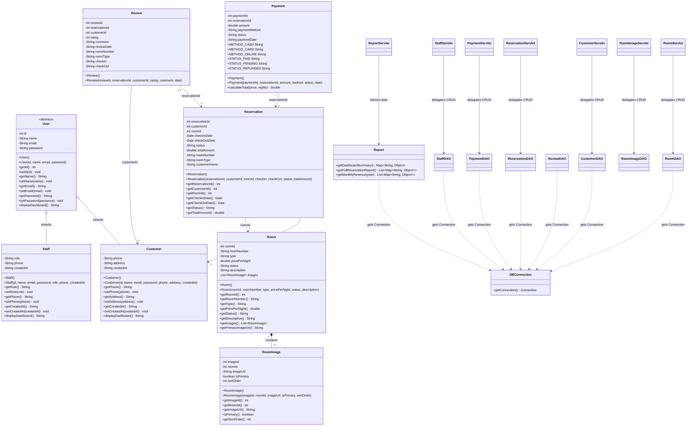

# Hotel Management System Backend UML Resources

This document contains a highly detailed prompt to generate UML diagrams for the backend codebase, along with pre-generated **Mermaid** class and architecture diagrams matching your Java classes.

---

## 1. Copy-Pasteable Prompt for UML Generation (With Detailed Relationships)

You can copy and paste the prompt below into Claude, ChatGPT, Gemini, or any diagramming tool (like Mermaid/PlantUML editors) to generate your UML diagrams.

```text
Act as a professional software architect. I need you to generate a detailed UML Class Diagram (e.g., in PlantUML or Mermaid syntax) for a Java-based Hotel Management System backend. The project uses a layered architecture, organized into functional modules.

Please construct the UML diagram according to the following package structures, class members, and relationships:

### Core Architecture & Layers
1. shared.models: Contains common abstractions.
2. module1_room to module6_review: Functional modules representing Domain Models and their corresponding Data Access Objects (DAOs).
3. shared.database: Utility to retrieve connections.
4. servlets: Presentation layer extending HttpServlet to handle GET, POST, PUT, DELETE, and CORS configurations.

### Classes and Member Specifications

#### [Package: shared.models]
- User (Abstract Class)
  - Fields:
    - - id: int
    - - name: String
    - - email: String
    - - password: String
  - Methods:
    - + User()
    - + User(id: int, name: String, email: String, password: String)
    - + getId(): int / setId(id: int): void
    - + getName(): String / setName(name: String): void
    - + getEmail(): String / setEmail(email: String): void
    - + getPassword(): String / setPassword(password: String): void
    - + displayDashboard(): String {abstract}

#### [Package: module2_customer]
- Customer (extends User)
  - Fields:
    - - phone: String
    - - address: String
    - - createdAt: String
  - Methods:
    - + Customer()
    - + Customer(id: int, name: String, email: String, password: String, phone: String, address: String, createdAt: String)
    - + getPhone(): String / setPhone(phone: String): void
    - + getAddress(): String / setAddress(address: String): void
    - + getCreatedAt(): String / setCreatedAt(createdAt: String): void
    - + displayDashboard(): String {overrides} // returns "customer_dashboard.jsp"
- CustomerDAO
  - Methods:
    - + addCustomer(Customer): boolean
    - + getCustomerById(int): Customer
    - + getCustomerByEmail(String): Customer
    - + updateCustomer(Customer): boolean
    - + deleteCustomer(int): boolean

#### [Package: module5_admin]
- Staff (extends User)
  - Fields:
    - - role: String // "Admin" | "Receptionist" | "Manager"
    - - phone: String
    - - createdAt: String
  - Methods:
    - + Staff()
    - + Staff(id: int, name: String, email: String, password: String, role: String, phone: String, createdAt: String)
    - + getRole(): String / setRole(role: String): void
    - + getPhone(): String / setPhone(phone: String): void
    - + getCreatedAt(): String / setCreatedAt(createdAt: String): void
    - + displayDashboard(): String {overrides} // returns "admin_dashboard.jsp"
- StaffDAO
  - Methods:
    - + addStaff(Staff): boolean
    - + getStaffById(int): Staff
    - + updateStaff(Staff): boolean
    - + deleteStaff(int): boolean

#### [Package: module1_room]
- Room
  - Fields:
    - - roomId: int
    - - roomNumber: String
    - - type: String
    - - pricePerNight: double
    - - status: String
    - - description: String
    - - images: List<RoomImage>
  - Methods:
    - + getPrimaryImageUrl(): String
- RoomImage
  - Fields:
    - - imageId: int
    - - roomId: int
    - - imageUrl: String
    - - isPrimary: boolean
    - - sortOrder: int
- RoomDAO
  - Fields:
    - - imageDAO: RoomImageDAO
  - Methods:
    - + addRoom(Room): boolean
    - + getAllRooms(): List<Room>
    - + getRoomById(int): Room
    - + updateRoom(Room): boolean
    - + deleteRoom(int): boolean
- RoomImageDAO
  - Methods:
    - + addRoomImage(RoomImage): boolean
    - + getImagesForRoom(int): List<RoomImage>
    - + deleteRoomImage(int): boolean

#### [Package: module3_reservation]
- Reservation
  - Fields:
    - - reservationId: int
    - - customerId: int
    - - roomId: int
    - - checkInDate: Date
    - - checkOutDate: Date
    - - status: String
    - - totalAmount: double
    - // Joined display fields
    - - roomNumber: String
    - - roomType: String
    - - customerName: String
- ReservationDAO
  - Methods:
    - + addReservation(Reservation): boolean
    - + getAllReservations(): List<Reservation>
    - + getReservationsByCustomerId(int): List<Reservation>
    - + updateReservationStatus(int, String): boolean
    - + deleteReservation(int): boolean

#### [Package: module4_payment]
- Payment
  - Fields:
    - - paymentId: int
    - - reservationId: int
    - - amount: double
    - - paymentMethod: String // "Cash" | "Card" | "Online"
    - - status: String // "Paid" | "Pending" | "Refunded"
    - - paymentDate: String
  - Methods:
    - + calculateTotal(pricePerNight: double, nights: int): double {static}
- PaymentDAO
  - Methods:
    - + addPayment(Payment): boolean
    - + getPaymentsByReservationId(int): List<Payment>
    - + updatePaymentStatus(int, String): boolean

#### [Package: module6_review]
- Review
  - Fields:
    - - reviewId: int
    - - reservationId: int
    - - customerId: int
    - - rating: int // 1-5
    - - comment: String
    - - reviewDate: String
    - // Joined display fields
    - - roomNumber: String
    - - roomType: String
    - - checkIn: String
    - - checkOut: String
- ReviewDAO
  - Methods:
    - + addReview(Review): boolean
    - + getReviewsByRoomId(int): List<Review>
    - + getAllReviews(): List<Review>
- Report
  - Methods:
    - + getDashboardSummary(): Map<String, Object>
    - + getFullReservationReport(): List<Map<String, Object>>
    - + getMonthlyRevenue(year: int): List<Map<String, Object>>

#### [Package: servlets]
Create Servlet classes extending HttpServlet (e.g. RoomServlet, CustomerServlet, PaymentServlet, ReservationServlet, StaffServlet, ReportServlet, RoomImageServlet). Specify that each Servlet:
- Declares a dependency on its corresponding DAO class (e.g. RoomServlet uses RoomDAO).
- Implements doGet(HttpServletRequest, HttpServletResponse)
- Implements doPost(HttpServletRequest, HttpServletResponse)
- Implements doPut(HttpServletRequest, HttpServletResponse) (if updates are allowed)
- Implements doDelete(HttpServletRequest, HttpServletResponse) (if deletions are allowed)
- Sets CORS Headers via setCorsHeaders(HttpServletResponse).

#### [Package: shared.database]
- DBConnection
  - Methods:
    - + getConnection(): Connection {static}

### Key UML Relationships to Represent:

1. **Generalization / Inheritance** (Solid line, hollow triangle pointing to parent):
   - `Customer` extends `User` (Customer --|> User)
   - `Staff` extends `User` (Staff --|> User)

2. **Composition / Strong Aggregation** (Solid line, filled diamond on container side):
   - `Room` contains a list of `RoomImage` instances. (Room "1" *-- "0..*" RoomImage)

3. **Directed Associations / Mappings** (Solid line, simple arrowhead pointing to destination, representing foreign key relationships):
   - `Reservation` maps to `Customer` via `customerId` (Reservation "many" --> "1" Customer)
   - `Reservation` maps to `Room` via `roomId` (Reservation "many" --> "1" Room)
   - `Payment` maps to `Reservation` via `reservationId` (Payment "many" --> "1" Reservation)
   - `Review` maps to `Reservation` via `reservationId` (Review "0..1" --> "1" Reservation)
   - `Review` maps to `Customer` via `customerId` (Review "many" --> "1" Customer)

4. **Dependencies** (Dotted line, simple arrowhead):
   - Every DAO class has a dependency on `shared.database.DBConnection` (DAO ..> DBConnection)
   - Every Servlet has a dependency on its respective DAO class (Servlet ..> DAO)
   - Servlets depend on custom model classes for request JSON serialization/deserialization (Servlet ..> Model)

Output a clean, valid class diagram using correct notations.
```

---

## 2. Pre-Generated Mermaid Class Diagram

Here is the exact UML class diagram for your backend system, written in Mermaid syntax. It will render directly in compatible markdown viewers.



---

## 3. Pre-Generated Package Architecture Diagram

This diagram shows how different modules and layers interact.

```mermaid
graph TD
    subgraph Controller / API Layer (servlets)
        RoomServlet
        CustomerServlet
        ReservationServlet
        PaymentServlet
        StaffServlet
        ReportServlet
        RoomImageServlet
    end

    subgraph Service / Persistence Layer (DAOs)
        RoomDAO
        RoomImageDAO
        CustomerDAO
        ReservationDAO
        PaymentDAO
        StaffDAO
        ReviewDAO
        Report
    end

    subgraph Domain Models Layer (Entities)
        User[shared.models.User]
        Customer[module2_customer.Customer]
        Staff[module5_admin.Staff]
        Room[module1_room.Room]
        RoomImage[module1_room.RoomImage]
        Reservation[module3_reservation.Reservation]
        Payment[module4_payment.Payment]
        Review[module6_review.Review]
    end

    subgraph Database Utilities (shared.database)
        DBConnection
    end

    %% Web Layer calls DAOs
    RoomServlet --> RoomDAO
    CustomerServlet --> CustomerDAO
    ReservationServlet --> ReservationDAO
    PaymentServlet --> PaymentDAO
    StaffServlet --> StaffDAO
    ReportServlet --> Report
    RoomImageServlet --> RoomImageDAO

    %% DAO Layer uses Models and Database Connection
    RoomDAO --> Room
    RoomDAO --> RoomImage
    RoomDAO --> DBConnection
    RoomImageDAO --> RoomImage
    RoomImageDAO --> DBConnection
    
    CustomerDAO --> Customer
    CustomerDAO --> DBConnection
    
    ReservationDAO --> Reservation
    ReservationDAO --> DBConnection
    
    PaymentDAO --> Payment
    PaymentDAO --> DBConnection
    
    StaffDAO --> Staff
    StaffDAO --> DBConnection

    ReviewDAO --> Review
    ReviewDAO --> DBConnection

    Report --> DBConnection

    %% Models Dependency
    Customer -.-> User : Extends
    Staff -.-> User : Extends
```
